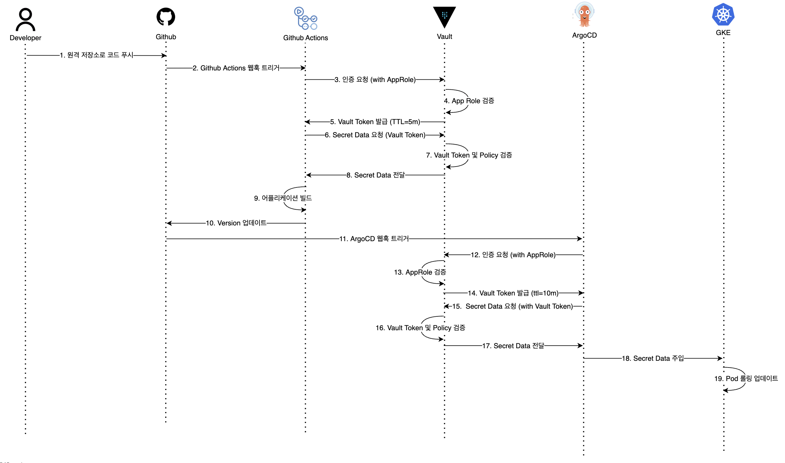
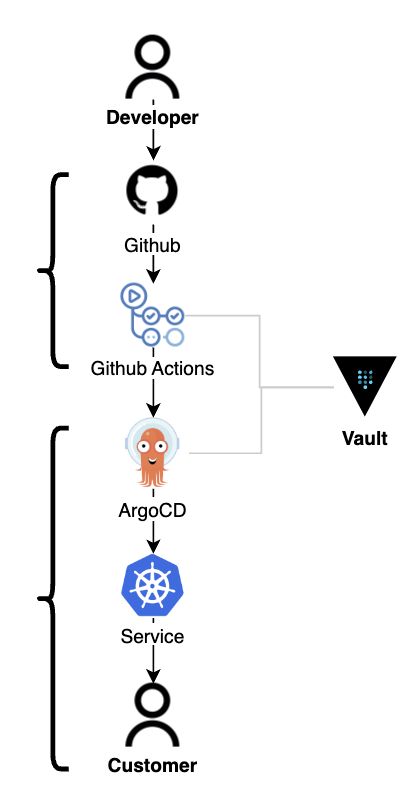
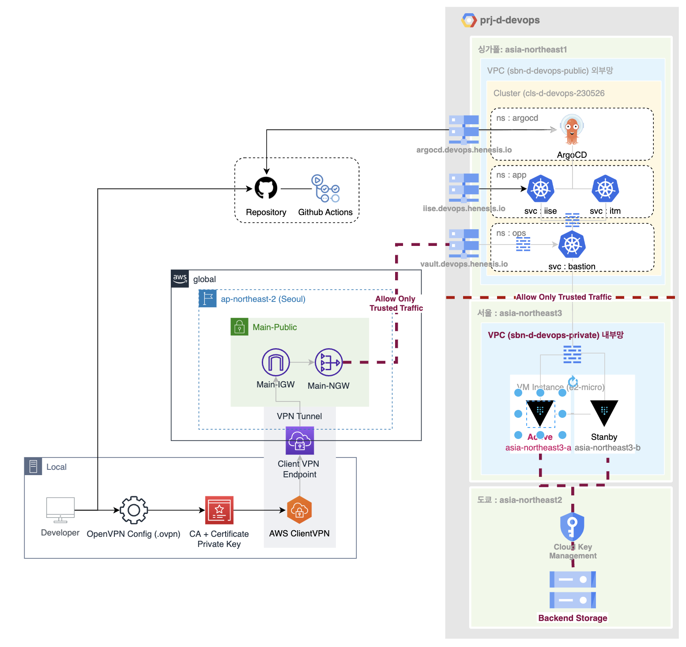

SeoulTech-Capston-Design
====
Zero-Trusted Pipeline
--
>본 프로젝트에서는 제로트러스트 모델을 적용한 안전하고 효과적인 배포 파이프라인을 구축합니다.
Secret 통합 관리 시스템인 Vault 를 활용합니다.
중앙 집중화를 통해 기업 보안을 달성하고 제품 전달 속도 및 Secret 관리 효율을 개선합니다.
--
### Skill Sets
- **GCP** - VPC Network, CloudDNS, GKE, GCE, GCS, CloudKMS, ArtifactRegistry  
  **AWS** - VPN Client, CertificateManager, ClientVPN
- **ImageBuilder** : Docker, Packer
  **Orchestration** : Kubernetes
  **PackageManager** : Helm
  **Automation** : Terraform
- **SCM** - Github
  **CI** - Github Action
  **CD** - ArgoCD
- **SecretManager** : HashiCorp Vault

### Repository Components
- **actions-runner** : Application Integration 을 위한 Github Actions
- **argocd** : Kubernetes 자동 배포를 위한 CD Tool
- **atlantis** : Infra 배포 자동화 Opensource
- **charts** : kubernetes manifests, 테스트용 타켓 어플리케이션 helm chart
- **terraform** : IaC (Infra as Code) 클라우드 인프라 관리 및 배포
- **vault** : 민감정보 관리을 위한 SecretManager

### User Scenario

### CI/CD Pipeline

### Infrastructure Architecture
