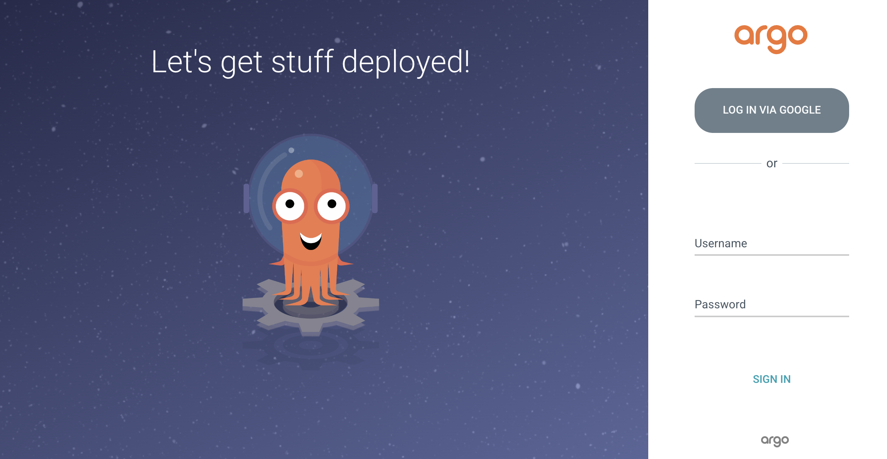
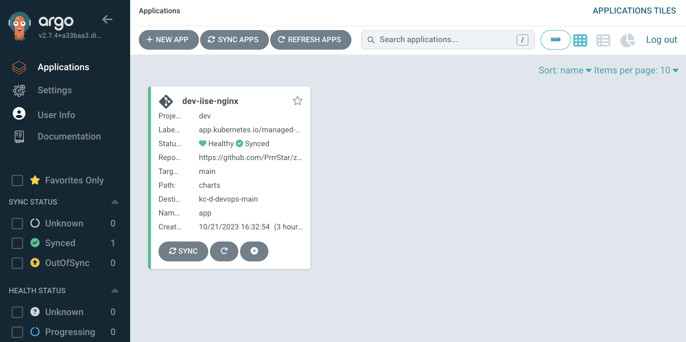

ArgoCD
===
## Endpoint
- https://argocd.devops.henesis.io
  
  
## Structure
```
apps : ArgoCD Application 을 관리한다.
├── Chart.yaml
├── templates       # Application Template (CRD)
├── test            # Test Template
└── values
    └── henesis     # 팀 별 Value File


infra : ArgoCD Infra 서비스를 관리한다.
├── applicationset-controller           # Application Status Check 컨트롤러
├── dex-server                          # Social Login 등 인증 관리 서버
├── metrics                             # Metric 서버
├── notifications-controller-metrics    # Notification 서버
├── redis                                 
├── repo-server                         # Repository 서버, 여기선 AVP 플러그인 활용
├── server                              # ArgoCD 의 코어 서버
|
├── README.md
├── crd.yaml                      
├── configmap.yaml                      # General Configmap 관리
├── crd.yaml                            # ArgoCD 커스텀 리소스
├── install.sh                          # 빠른 설치를 위한 커스텀 스크립트
├── networkpolicy.yaml                  # 외/내부 통신 정책 설정
├── rbac.yaml                           # 역할정 기반 접근제어 설
├── argocd-secret.yaml                  # ArgoCD 관리에 필요한 민감정보
└── role.yaml                           # Role 기반 Kubernetes 리소스 통신 제어 
```

## Deployment
### Infrastructure
- ArgoCD Secret 파일 작성
  - Template
    ```yaml
    # dex.google.clientId/Secret : Google SSO Login 
    # AVP_ROLE_ID/AVP_SECRET_ID : ArgoCD Vault Plugin
    
    apiVersion: v1
    data:
      dex.google.clientId: ""     # OIDC Google 인증을 위함
      dex.google.clientSecret: "" # OIDC Google 인증을 위함
    stringData:
      webhook.github.secret: ""   # Github webhook Push 트리거 통신을 위한 secret 
    kind: Secret
    metadata:
      labels:
        app.kubernetes.io/name: argocd-secret
        app.kubernetes.io/part-of: argocd
      name: argocd-secret
      namespace: argocd
    type: Opaque
    ---
    apiVersion: v1
    data:
      AVP_AUTH_TYPE: ""         # approle 기반 Vault 통신 
      AVP_ROLE_ID: ""           # ArgoCD 에 맵핑할 역할
      AVP_SECRET_ID: ""         # ArgoCD 에 맵핑할 역할의 Secret
      AVP_TYPE: ""              # vault
      VAULT_ADDR: ""            # "ArgoCD 와 Vault 통신을 위한 Vault endpoint"
      VAULT_NAMESPACE: ""       # default : admin
    kind: Secret
    metadata:
      name: argocd-vault-plugin-credentials
      namespace: argocd
    type: Opaque
    ```
  - Secret Update
    ```bash
    # Cluster 권한 획득
    gcloud container clusters get-credentials kc-d-devops-main --region asia-northeast1-a --project prj-d-devops-402107
    
    # Apply
    kubectl apply -f {SECRET_FILE}.yaml -n argocd
    ```
    

- Infra 서버 구동
    ```bash
    ./install.{TEAM}.{ENV}.sh
    ```
- ArgoCD DNS 설정
    ```bash
    cd ./server 
    kubectl apply -f ingress.{ENV}.yaml -n argocd
    ```
- ArgoCD 외부 클러스터 추가
    ```bash
    # Example
    
    # 초기 비밀번호 확인 (Base64 인코딩된 값)
    kubectl get secret argocd-initial-admin-secret -n argocd -oyaml
    
    # 어드민 비밀번호 변경
    argocd account update-password --account foobar
    
    # ArgoCD CLI 로 로그인
    argocd login argocd.dev.henesis.io
    # Username : admin
    # Password : {argocd-initial-admin-secret}
  
    # 외부 클러스터 추가 (예시 Henesis Cluster)
    argocd cluster add gke_prj-d-henesis_asia-northeast3-a_kc-d-henesis-230419 --name kc-d-henesis-230419
    ```

### Application
- Github 연동하기 (using GithubPAT)
- Project 생성 및 AllowList 적용
- 어플리케이션 배포
  ```bash
  cd ./apps
  helm upgrade --install {RELEASE_NAME} -f values/{TEAM}/values.{ENV}.yaml .
  ```